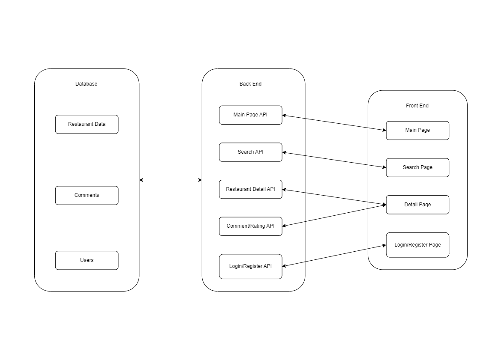

# YumRev

## Group Name

lszz

## Group member names and NetIDs

* Peter Zhu(bowenz12): front-end
* Xing Zhao(xingz6): front-end
* Boyang Sun(boyangs3): back-end

## Project Introduction

It’s always difficult to choose restaurants for meals if there is no recommendation. Restaurant Evaluation collects dishes, users’ ratings, comments in text format towards multiple restaurants and then saves them, providing suggestions before you make the decision.

## System Overview
Our project has a React, JavaScript as frontend, Express, MySQL as the backend.

YumRev is a full-stack web application consisting of a front-end client built using React and Material-UI and a back-end server responsible for handling data and user authentication. we used the MUI component library to make our each component concise and save us much work. 

The SQLite database has tables for data managenment in order for users to browse a list of restaurants, view details of each restaurant, rate and comment on their experiences, and get personalized recommendations based on user preferences and ratings.

## Running Instructions

To set up and run the YumRev application, follow the instructions provided in the respective README files for the front-end client and back-end server.

Then:

1. open the website.
2. register as a user and begin to searching, rating and commenting on the website.

### images:

### Front-end Client

Refer to the README.md file in the `client` directory for instructions on setting up and running the front-end client application. You can find it [here](./client/README.md).

### Back-end Server

Refer to the README.md file in the `server` directory for instructions on setting up and running the back-end server application. You can find it [here](./backend/README.md).

For a seamless experience, it is recommended to run both the front-end client and back-end server concurrently.

## Reference

[CS 222 Project](https://courses.grainger.illinois.edu/CS222/sp2023/)

[React](https://react.dev/)

[MUI](https://mui.com/)

[MySQL](https://www.mysql.com/)

[Express](https://expressjs.com/)

[npm](https://www.npmjs.com/)
